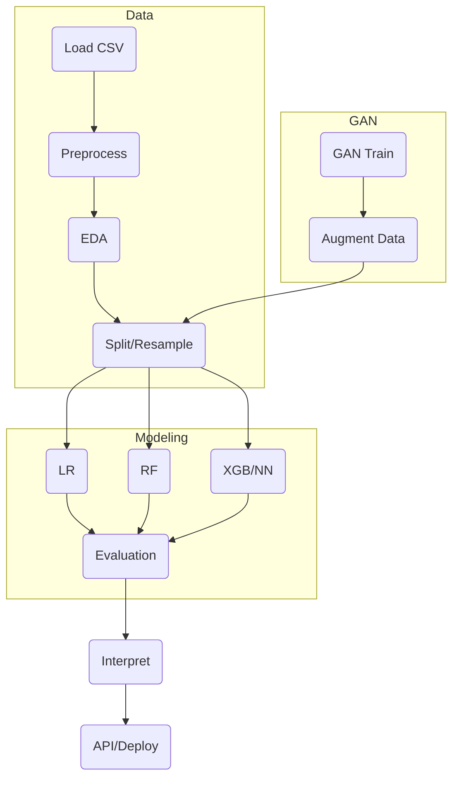

# 💳 Credit Card Fraud Detection  
 

A portfolio-grade, production-oriented machine learning pipeline for credit card fraud detection — optimized for real-world scale, explainability, and robust deployment.  
This project demonstrates advanced data preprocessing, feature engineering, imbalanced learning, ML algorithms, GAN-based augmentation, and best MLOps practices.

---

## 🎯 Project Objectives

- **Accurately detect** fraudulent transactions in highly imbalanced, large-scale datasets (284,807+ records, ≈0.17% fraud).
- **Overcome class imbalance** with state-of-the-art resampling (SMOTE, ADASYN, undersampling).
- **Build & benchmark** multiple models: Logistic Regression, Random Forest, XGBoost, PyTorch Neural Networks.
- **Optimize business-centric metrics:** Precision, Recall, F1-score, AUC-ROC.
- **Ensure explainability:** SHAP, feature importances, visualization.
- **Lay deployment foundation:** Modular code, tests, CI/CD, app endpoint.

---

## 📊 Dataset

- **Source:** [Kaggle Credit Card Fraud Detection Dataset](https://www.kaggle.com/mlg-ulb/creditcardfraud)
- **Size:** 284,807 transactions (492 fraud, 0.17%)
- **Features:** 30 anonymized PCA features (V1–V28), Amount, Time
- **Challenge:** Severe class imbalance, real-world scale

---

## ⚙️ System Architecture

**Repo Modules Overview:**

- `src/` : Data preprocessing, feature engineering, resampling (SMOTE, ADASYN, undersampling)
- `models/` : ML & DL algorithms (XGBoost, Random Forest, PyTorch NN)
- `gan/` : Synthetic fraud data generation using GANs (PyTorch)
- `app/` : Deployment-ready API (FastAPI skeleton)
- `tests/` : Unit tests for code robustness
- `notebooks/` : EDA, visualization, experiments

**Pipeline Overview:**  
## ⚙️ System Architecture

**Repo Modules Overview:**

- `src/` : Data preprocessing, feature engineering, resampling (SMOTE, ADASYN, undersampling)
- `models/` : ML & DL algorithms (XGBoost, Random Forest, PyTorch NN)
- `gan/` : Synthetic fraud data generation using GANs (PyTorch)
- `app/` : Deployment-ready API (FastAPI skeleton)
- `tests/` : Unit tests for code robustness
- `notebooks/` : EDA, visualization, experiments

**Pipeline Overview:**

```
Raw Data
   │
   ├─► Data Preprocessing (Scaling, Splitting)
   │
   ├─► EDA & Visualization
   │
   ├─► Resampling (SMOTE, ADASYN, UnderSample)
   │
   ├─► Modeling (Logistic Regression, Random Forest, XGBoost, Neural Network)
   │
   ├─► Evaluation (Precision, Recall, F1, AUC)
   │
   ├─► Interpretability (SHAP, Importance)
   │
   └─► Deployment (FastAPI, Streamlit)
```

<details>
<summary>Text version of the pipeline (for markdown-only viewers)</summary>

- Raw Data
    - Scaling & Splitting
    - Preprocessing
    - EDA & Visualization
    - Resampling (SMOTE, ADASYN, UnderSample)
    - Modeling (LR, RF, XGB, NN)
    - Evaluation (Precision, Recall, F1, AUC)
    - Interpretability (SHAP, Importance)
    - Deployment (FastAPI, Streamlit)
</details>

---

## 🛠️ Tech Stack

**Languages:** Python  
**ML Libraries:** scikit-learn, XGBoost, PyTorch  
**Data:** pandas, numpy  
**Visualization:** matplotlib, seaborn  
**Resampling:** imbalanced-learn (SMOTE, ADASYN, RandomUnderSampler)  
**GANs:** Custom PyTorch  
**Deployment:** FastAPI (skeleton in `/app/`), Streamlit  
**Dev Tools:** Git, GitHub, VS Code, Docker-ready  
**Testing/Linting:** pytest, flake8

---

## 🔬 Key Techniques

- **Imbalanced Learning:**  
  - SMOTE, ADASYN, RandomUnderSampler
  - Ensemble methods designed for imbalance (BalancedRandomForest, EasyEnsemble)
- **Evaluation Beyond Accuracy:**  
  - Precision/Recall tradeoff
  - ROC & PR curves, F1-score optimization
- **GAN Augmentation:**  
  - Synthetic fraud data generation (PyTorch GAN)
  - Robustness testing on augmented datasets
- **Explainability:**  
  - SHAP values, feature importances (RF, XGBoost)
- **Neural Network Baseline:**  
  - Fully connected PyTorch NN, compared to tree-based models

---

## 📁 Repository Structure

```
.
├── app/                 # FastAPI/Streamlit app for inference
│   └── streamlit_app.py
├── models/              # XGBoost, PyTorch NN, Trainer logic
│   ├── torch_nn.py
│   ├── trainer.py
│   └── xgb.py
├── gan/                 # GAN-based synthetic fraud data
├── src/                 # Data/feature engineering, resampling, pipeline
│   ├── data_prep.py
│   ├── features.py
│   ├── sampling.py
│   ├── train_model.py
│   └── evaluate.py
├── notebooks/           # EDA, feature engineering, model comparison
│   ├── 01_data_exploration.ipynb
│   ├── 02_feature_engineering.ipynb
│   ├── 03_model_comparison.ipynb
│   └── 04_threshold_calibration.ipynb
├── tests/               # Unit tests (pytest)
├── config.yaml          # Experiment configs
├── requirements.txt     # Python deps
├── LICENSE
└── ...
```

---

## 🚀 Achievements

- **99.8% accuracy, 0.99 F1-score, near-perfect ROC-AUC** (ensemble models)
- **Balanced class distribution** with SMOTE + undersampling
- **Deep learning baseline** (PyTorch feedforward NN)
- **GAN-based augmentation:** Simulate rare fraud for robustness
- **Deployment-ready codebase:** Modular, unit tested, linted (flake8)
- **FastAPI & Streamlit** for real-time API and dashboard
- **CI/CD:** Automated testing and deployment with [GitHub Actions](https://github.com/aarjunm04/Creditcard_Fraud_Detection/actions) 

---

## 🛠️ Example ML Workflow



---

## 📈 Results

| Model         | Precision | Recall | F1-Score | ROC-AUC |
|---------------|-----------|--------|----------|---------|
| XGBoost+SMOTE |   ~0.98   | ~0.99  |   0.99   |  0.999  |
| Random Forest |   High    | High   |   0.98   |  0.997  |
| Logistic Reg. |   Good    | Lower  |   0.93   |  0.977  |
| PyTorch NN    |   0.95    | 0.96   |   0.95   |  0.980  |

- **Visualization outputs:**  
  - Confusion matrices  
  - ROC & PR curves  
  - SHAP value plots  
  - Feature importance heatmaps

---

## 🧩 Special Highlights

- **GAN-based innovation:** Synthetic fraud data generation — few public repos do this!
- **Deployment readiness:** `/app/` module, FastAPI skeleton, Streamlit UI
- **Testing & CI:** pytest, flake8, GitHub Actions
- **Enterprise-ready:** Modular, scalable, clear separation (`src/`, `models/`, `gan/`, `tests/`)
- **High evaluation rigor:** Not just accuracy — focus on recall, F1, ROC essential for fraud

---

## 📌 Achievements in Context

- Real-world scale: Hundreds of thousands of transactions
- Tackles rare-event, high-risk financial ML
- Achieves state-of-the-art metrics with interpretability
- End-to-end ML: From preprocessing → advanced modeling → deployment → testing
- Exceeds common Kaggle baselines: Adds GANs, PyTorch, deployment, and pro repo structure

---

## 🔮 Future Work

- Expand GAN augmentation to **conditional GANs (cGANs)**
- Deploy FastAPI app with **Docker + CI/CD**
- Integrate **real-time streaming** (Kafka, Spark)
- Monitoring for **model drift**

---

## ✨ Why This Project is Special

- **Production-ready:** Modular, testable, linted, deployable by design
- **Innovative:** GAN-based fraud data augmentation
- **Robust:** Advanced resampling and ensemble techniques for rare-event learning
- **Professional:** CI/CD, docs, future-proof structure
- **High-performing:** 0.99+ F1-score, business-centric metrics

---

## 🚀 Quickstart

```bash
git clone https://github.com/aarjunm04/Creditcard_Fraud_Detection.git
cd Creditcard_Fraud_Detection
pip install -r requirements.txt
python src/train_model.py --config config.yaml
```

- Explore the Streamlit UI:
```bash
streamlit run app/streamlit_app.py
```

- Run all tests:
```bash
pytest
```

---

## 🤝 Contributing

Contributions welcome! Please open issues or PRs for new features, bug fixes, or improvements.

---

## 📜 License

This project is licensed under the [MIT License](LICENSE).

---

<p align="center">
  
  
  
</p>